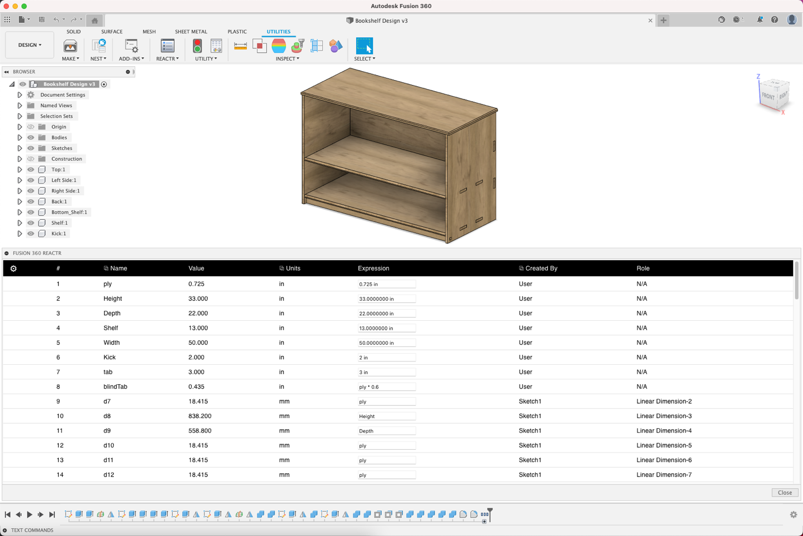
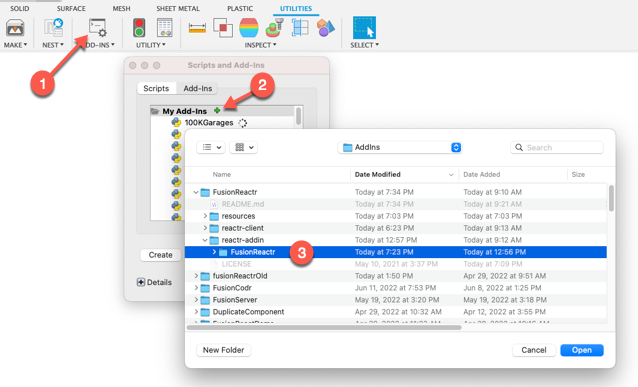

# FusionReactr

Fusion 360 Add-in to demonstrate building a more complex HTML UI 



## This is very much a work in progress!

### Needs significant documentation.

## To run the addin:
1. Clone the repo
2. Navigate to `/FusionReactr/reactr-client/` in the terminal
3. Execute `npm install`
4. Execute `npm start`
5. Open Fusion 360 Addins Dialog
6. Select the green plus-sign and navigate to: `/FusionReactr/reactr-addin/FusionReactr/`



## Note on developing in Fusion 360

Open `/FusionReactr/reactr-addin/FusionReactr/config.py`

Find the following:

```
Set true to run local dev server
If set False, Execute: npm run build
This will build the latest changes to static site
REACT_DEV = True
```

To distribute the app you would want to do a production build of the web client

Only the add-in and built client files would be distributed.  

__TODO:__ Include build and distribution instructions

## Steps used to create this addin:

### Create top level directory: `FusionReactr`

### Create addin 

* Create directory: `reactr-addin`
* Create new Fusion 360 Add-in
* Move the new Add-in directory to inside `reactr-addin`


## Create React App:

`npx create-react-app reactr-client`

## Install Dependencies

### TanStack
This project leverages react-table and react-query

[Learn more at https://tanstack.com/](https://tanstack.com/)

`npm install react-query react-table`

### Material UI

[Learn more at https://mui.com/](https://mui.com/)

_Note: it could be removed in favor of other ui libraries_

To use Material UI:

`npm install @mui/material @emotion/react @emotion/styled @mui/icons-material`


### License
THE SOFTWARE IS PROVIDED "AS IS", WITHOUT WARRANTY OF ANY KIND, EXPRESS OR IMPLIED,
INCLUDING BUT NOT LIMITED TO THE WARRANTIES OF MERCHANTABILITY, FITNESS FOR A PARTICULAR PURPOSE AND NONINFRINGEMENT.
IN NO EVENT SHALL THE AUTHORS OR COPYRIGHT HOLDERS BE LIABLE FOR ANY CLAIM, DAMAGES OR OTHER LIABILITY,
WHETHER IN AN ACTION OF CONTRACT, TORT OR OTHERWISE, ARISING FROM, OUT OF OR IN CONNECTION WITH THE SOFTWARE
OR THE USE OR OTHER DEALINGS IN THE SOFTWARE.

[MIT License](./LICENSE)

### Authors

`FusionReactr` was written by [Patrick Rainsberry](https://tapnair.github.com)

